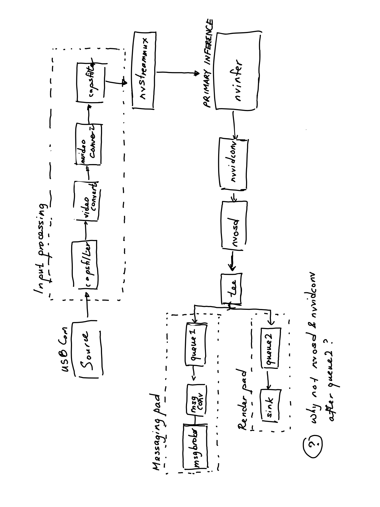

# DeepStream end-to-end pipeline

This repo contains the

It is divided into two parts as shown in this image:

The pipeline that lives on the Jetson is called `jetson-ml`.
This is the DeepStream pipeline that takes in input
from a USB camera,
performs inference on it to detect 8 classes of objects,
then sends out the 3D bounding polygon data over the AMPQ (RabbitMQ) protocol.
More details on how the pipeline works can be found in the `jetson-ml` folder.

The module that lives on the central command-and-control EC2 instance
is called `rabbitmq-server`.
It receives the bounding poly messages sent out by the Jetson ML pipeline and
publishes them out over ROS2 for consumption by other RMF core modules.
