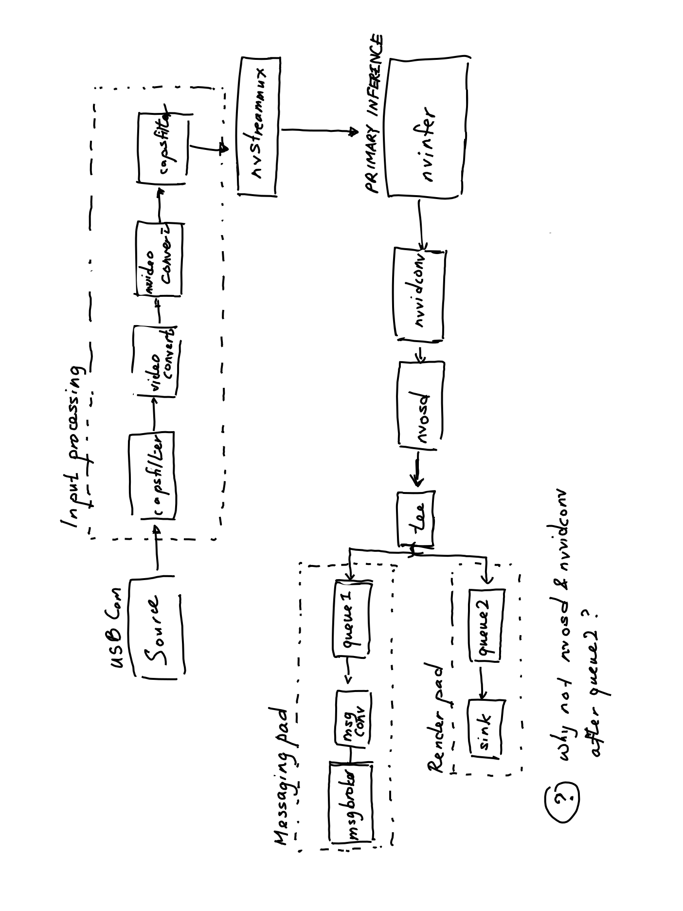

## Introduction

The
[README](https://github.com/NVIDIA-AI-IOT/deepstream_python_apps/tree/master/apps/deepstream-test4)
for Nvidia's Python sample app `deepstream-test4` does not explain itself well.
It presumes some knowledge of the SDK and of GStreamer that
I don't necessarily have,
and leaves many things unexplained.
This guide hopes both to remedy that defect,
as well as surface some of the doubts I still have.

## Overview

There are two main parts that make up the DeepStream application.

First, there is a pipeline
that largely resembles the GStreamer pipeline except with Nvidia's
custom elements.
The most important elements are
the source element,
the primary inference element `nvinfer` and
the sink element.

Secondly there is a _probe_ function called `osd_sink_pad_buffer_probe`.
This is a callback function that is called at the end of the GStreamer pipeline
(a _sink node_, in GStreamer parlance).
This buffer probe is responsible for populating the metadata of the various
DeepStream objects and performing things like displaying text on screen
or sending JSON data through RabbitMQ.

I will explain how these two components work together.

## GStreamer pipeline

I've modified the sample app 4 to take in USB webcam input.
This is an image of how the elements in the pipeline connect to one another:



### Lifecycle of the pipeline

How does the pipeline work?

First it takes in an input source.
The original sample app took in a `.h264` stream but I have modified it to
take in webcam video input instead.

Then the video goes through several input processing steps:
these are the `capsfilter` and `videoconvert` elements.

After it has been processed, it is then fed into a multiplexer
(`nvstreammux`) which can handle multiple input videos.
In this case we only have one input stream so the multiplexer is unnecessary
(I think).

This video is then fed to the **primary inference engine**, `nvinfer`.
This is the element that does all the deep learning work.
Its behaviour can be modified by the file `dstest4_pgie_config.txt`.
`nvinfer` takes in an input `GstBuffer` and returns
the output `GstBuffer` and modified metadata from the inference,
`NvDsBatchMeta`.

The results of the inference are then passed to post-processing.
`nvvidconv` is a convertor to convert from NV12 to RGBA, which is required
by the next element `nvdsosd`, or `NvDsOnScreenDisplay`.
`nvdsosd` is responsible for drawing the results on an RGBA buffer.

After post-processing the data is passed to a `tee` element which splits the
output into two. One output goes to `queue2`, which is the "render queue",
rendering the output/bounding boxes onto the display.
The other output goes to `queue1` which is the 'messaging queue':
this goes to `NvMsgConv`, which converts a buffer to an NvDsPayload in JSON format
(see [this link](https://docs.nvidia.com/metropolis/deepstream/dev-guide/index.html#page/DeepStream%20Plugins%20Development%20Guide/deepstream_plugin_details.html#wwpID0E0LP0HA),
which then goes to `NvMsgBroker`, which takes the payload and sends it out using
an appropriate protocol adapter. In this case I am using RabbitMQ.

Finally, we add a probe to the `sink` pad after `queue1`,
which modifies the `GstBuffer`.
The following line of code adds the probe to the pad:

`osdsinkpad.add_probe(Gst.PadProbeType.BUFFER, osd_sink_pad_buffer_probe, 0)`

More on this later.

### Things I'm still unclear about

#### What is `streammux.get_request_pad()`?

I don't understand what is going on in the following line:

```
sinkpad = streammux.get_request_pad("sink_0")
```

#### How are the changes in the `sink` pad propagated to the `NvMsgBroker` sink?

The buffer probe attaches to the `sink` pad linked to `queue2`,
and makes changes to that `GstBuffer`.
But the `NvMsgBroker` sink is linked to `queue1`.
How are the changes in the `sink` sink propagated to the `NvMsgBroker` sink?
Is the `GstBuffer` shared between these two sinks?
Or are the changes propagated upstream somehow to before the `tee` element?
What is the data model?
(I suspect the answer to the question will be apparent to someone who
actually knows a thing or two about GStreamer.)
See also
[this GStreamer tutorial on tees and multithreading](https://gstreamer.freedesktop.org/documentation/tutorials/basic/multithreading-and-pad-availability.html?gi-language=c)


## Buffer probe

We have a "probe", which is a GStreamer concept.
A probe is a callback function we can call on a sink
(in this case, the `GstBuffer`).
In this sample app, the probe allocates memory and writes `NvDsEventMsgMeta`
metadata to each frame.

### Lifecycle of the probe

1. Get BatchMeta from the GStreamer buffer
   using `pyds.gst_buffer_get_nvds_batch_meta(hash(gst_buffer))`
2. Get each FrameMeta in BatchMeta
3. Get each ObjectMeta in FrameMeta using `frame_meta.obj_meta_list`.
4. Generate NvDsEventMsgMeta for each ObjectMeta every 30 frames
5. Acquire UserMeta from Pool of BatchMeta using `pyds.nvds_acquire_user_meta_from_pool`
6. Attach the NvDSEventMsgMeta to the UserMeta using `user_event_meta.user_meta_data = msg.meta`
7. Set custom copy and release callbacks
8. Add user meta to frame (not sure what this is for) using `pyds.nvds.add_user_meta_to_frame`

First the probe gets all `BatchMeta` metadata from the `sink` pad.
Then the probe gets all `FrameMeta` metadata from the `BatchMeta` metadata.
For each frame, it gets all the objects in that frame,
and then may produce a `NvDsEventMsgMeta` object for each object.

#### For each object in frame:

For each object in frame, the following happens:

In order to produce the `NvDsEventMsgMeta` it needs to allocate memory
using the helper function `pyds.alloc_buffer()` inside `generate_event_msg_meta`

This is where my understanding gets a bit hazy.
For some reason we need to set the `user_meta_data` property of `UserMeta`
to the `NvDsEventMsgMeta` object.
Then, because custom metadata added to NvDsUserMeta requires custom copy
and release functions,
we need to provide and attach custom copy and release callback functions
onto the `UserMeta` object.
Finally, we need to attach the `UserMeta` objects to the frame.

#### What is a BatchMeta?

- A batch is a "pool" of frames from different data sources.

### Things I'm still unclear about

#### What is a UserMeta?

- still don't know what this is, and the documentation is very unhelpful.
- Why aren't we using `DisplayMeta` instead like we did for the previous sample apps?

#### Why do I need to attach UserMeta to FrameMeta?

#### What is `user_meta_data` in User Meta?

Looking at the official documentation
([link](https://docs.nvidia.com/metropolis/deepstream/5.0/dev-guide/DeepStream_Development_Guide/baggage/struct__NvDsUserMeta.html#a0577ce8fda601fb72c6285c5413c2cf6))
gives me the following incredibly unhelpful answer:

```
void* _NvDsUserMeta::user_meta_data
Holds a pointer to user data to be attached.

See the deepstream-user-metadata-test example for usage.
```

#### Why do we need to `acquire_user_meta_from_pool`?

Here's the official
[Python API documentation](https://docs.nvidia.com/metropolis/deepstream/python-api/Methods/methodsdoc.html?highlight=nvds_add_user_meta%20to_frame#nvds-acquire-user-meta-from-pool):

```
User must acquire the user meta from the user meta pool to fill user metatada
```

There's no explanation of why we must acquire the user meta from the user meta pool.

### What is happening when we call `add_user_meta_to_frame`?

Why do we need to add user meta to frame?
Again, I looked at the
[official documentation](https://docs.nvidia.com/metropolis/deepstream/python-api/Methods/methodsdoc.html?highlight=nvds_add_user_meta%20to_frame#pyds.nvds_add_user_meta_to_frame)

which says

```
After acquiring and filling user metadata user must add
it to frame metadata if required at frame level with this API
```

and this is again incredibly obtuse.

_Why_ must I add it to frame metadata?
_Is_ it required at frame level??? Who knows??
The distinguished NVIDIA engineers certainly do, but
I don't, seeing as nobody has ever explained this to me in the documentation.

## Appendix

[Asked a question on the Nvidia Developer Forums](https://forums.developer.nvidia.com/t/type-object-pyds-nvdsobjecttype-has-no-attribute-nvds-object-type-unknown/157360)
